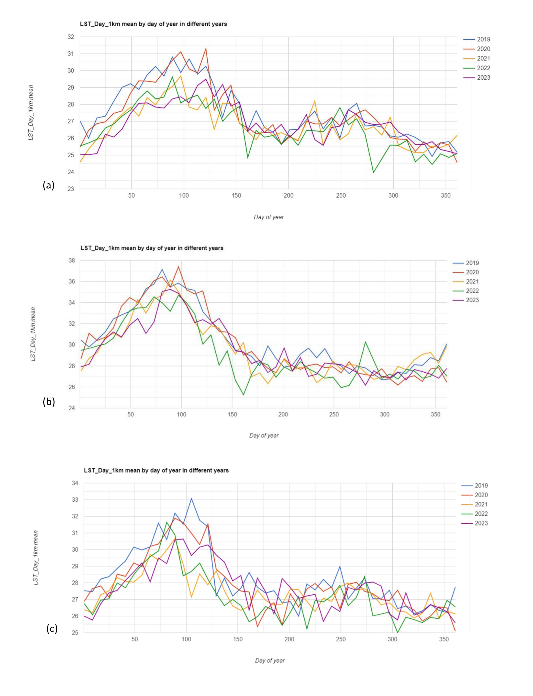
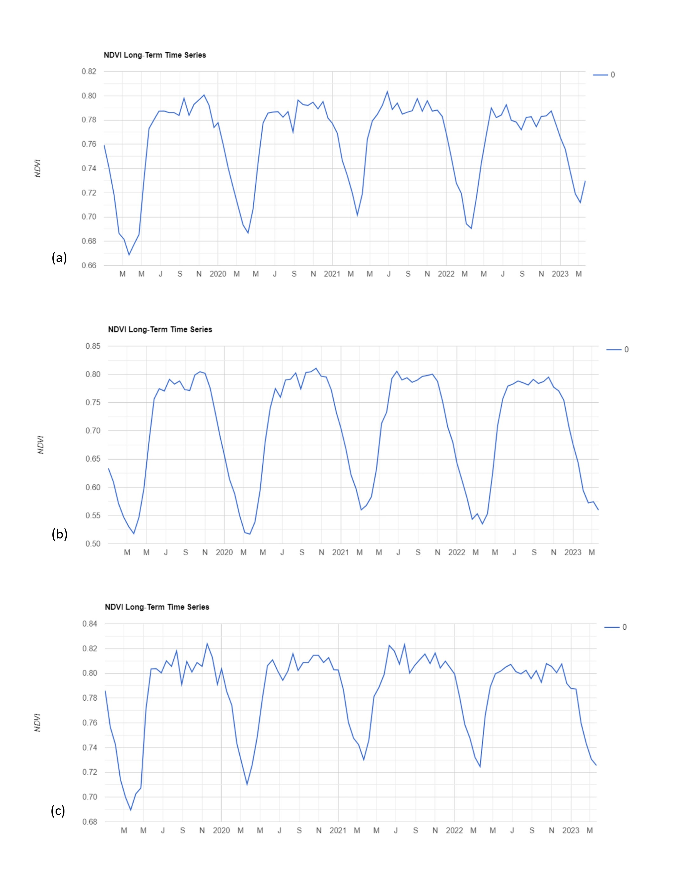

# CloudComputing_finalproject
Relationship among land surface temperature (LST), normalized difference vegetation index (NDVI) with topographic elements in Central America.

A Land Surface Temperature 5 years time series analysis between 2019-2023 combined with a separate normalized difference vegetation index (NDVI) 5 years time series analysis during the same period and a DEM model with topographic slope elements in three different countries in Central America such as Costa Rica, El Salvador, and Panama aims to demonstrate the relationship among them as indicators of warmth rising off Earth’s landscapes influences (and is influenced by) our world’s weather and climate patterns. 
The Land Surface Temperature (LST) is a measurement of how hot the land is to the touch and the NDVI is used to quantify vegetation greenness and is useful in understanding vegetation density and assessing changes in plant health within values between − 1 and 1.
The study is applied to Costa Rica, El Salvador, and Panama due to their different landforms and infrastructure despite their geographical proximity. The current study used the Moderate Resolution Imaging Spectroradiometer (MODIS) sensor due to its optimal temporal coverage and its global coverage.
This study's findings can be used to ensure sustainable urban development and minimize urban heat island effects by providing effective guidelines for urban planners, policymakers, and respective authorities in the Central America region. The current thermal remote sensing findings can be used to model energy fluxes and surface processes in the study area. It is important to note that how this study was carried out allows for its applicability to other areas of the world.

Fig 1. The image above is the results of the Land Surface Time Series analysis in the countries of study Costa Rica(a), El Salvador (b), and Panama (c) from 2019 to 2023.
Showing 2019 and 2020 as the years with the highest LST and 2022 with the lowest LST in the study region.

Fig 2. The image above is the results of the Normalized Difference Vegetation Index (NDVI) time series analysis in the countries of study Costa Rica(a), El Salvador (b), and Panama (c) from 2019 to 2023.
NDVI values between 0 and 0.3 indicate barren areas with little to no vegetation cover, values between 0.3 and 0.6 areas with sparse vegetation cover, and NDVI values between 0.6 and 0.9 indicate areas with dense and healthy vegetation cover.

Over the previous decades, rapid urbanization and deforestation in the study region resulted in a loss of vegetation, exposing bare soil and rock to sunlight in the study region. This decreases thermal inertia and surface heat energy leading to high LST zones. In addition to urbanization and deforestation, uneven topography also led to high LST zones. LST and elevation findings showed an inverse distribution pattern, indicating that LST increases as elevation decreases. The LST is lower in high-elevation areas than in lower-elevation areas. The land surface temperature characteristics of a region are influenced by natural factors such as latitude, elevation, and the presence of ocean currents. The precipitation characteristics of a region are influenced by factors such as proximity to mountain ranges and prevailing winds, being the reason why the result of a country of Costa Rica has the lowest LST.

https://code.earthengine.google.com/d745dbba8d1ae09389080a2bbea26532 
[google_ee_Arguello.txt](https://github.com/AriANCA/CloudComputing_finalproject/files/14964557/google_ee_Arguello.txt)
